# 🛒 **eCommerce Microservices Project Documentation**

## 1. 📘 Introduction

### 1.1 🎯 Workshop Objectives

This workshop is designed to provide hands-on guidance in building a **resilient, scalable microservices architecture** tailored for modern eCommerce platforms, grounded in industry-proven software engineering practices. It goes beyond technical implementation to cultivate a deep, practical understanding of:

* Core microservices principles  
* DevOps culture and automation  
* Software quality, observability, and resilience  

**Primary objectives of the workshop include:**

* ✅ Designing a modular, decoupled architecture built for scalability  
* 🔁 Automating the end-to-end software delivery lifecycle  
* 📦 Ensuring environment consistency and deployment portability  
* 🚀 Managing and orchestrating services in production environments  
* 🧪 Implementing a robust, multi-level testing strategy  
* 🔍 Enabling full observability, traceability, and system introspection  


## 2. 🧩 Architecture Overview

### 2.1 🧱 Microservices Breakdown

This system consists of **10 core business microservices** and **3 infrastructure services**, each responsible for a specific domain in the eCommerce ecosystem.


#### 🔹 Business Microservices

| **Service**         | **Port** | **Responsibility & Justification**                                                                       |
| ------------------- | -------- | -------------------------------------------------------------------------------------------------------- |
| `user-service`      | 8700     | Handles user management (registration, auth, profiles). Decoupled for scalability and enhanced security. |
| `product-service`   | 8500     | Manages the product catalog and inventory. High throughput service.                                      |
| `order-service`     | 8300     | Responsible for order processing and management. Requires strong data consistency.                       |
| `payment-service`   | 8400     | Handles financial transactions. Isolated for security (PCI-DSS) and third-party payment integration.     |
| `shipping-service`  | 8600     | Manages shipping and logistics. Easily integrates with external transport services.                      |
| `favourite-service` | 8800     | Manages user favorite lists. Lightweight, independently scalable.                                        |

#### 🛠 Infrastructure Services

| **Service**                  | **Port** | **Purpose**                                                                         |
| ---------------------------- | -------- | ----------------------------------------------------------------------------------- |
| `service-discovery` (Eureka) | 8761     | Enables dynamic service registration and discovery.                                 |
| `cloud-config`               | 9296     | Centralized external configuration. Ensures consistency across environments.        |
| `api-gateway`                | -        | Single entry point with routing, authentication, rate limiting, and load balancing. |

#### ⚙️ Supporting Services

| **Service**    | **Port** | **Purpose**                                                                  |
| -------------- | -------- | ---------------------------------------------------------------------------- |
| `proxy-client` | -        | Simplifies HTTP communication between services with circuit breakers.        |
| `zipkin`       | 9411     | Distributed tracing for monitoring and debugging multi-service interactions. |

--- 

### 2.2 🎯 Justification for Service Selection and Integration Strategy
The selection of these services is strategic and intentional, as they reflect core business capabilities and critical integration flows within a modern eCommerce ecosystem. Their interdependencies make them ideal for implementing meaningful end-to-end (E2E) testing, robust observability, and scalable automation pipelines.

These services were chosen for the following key reasons:

* **Critical Business Coverage:**
Each business microservice encapsulates a distinct domain (e.g., user management, order processing, payments), collectively representing the primary customer journey. This granularity allows for focused development, testing, and scaling of each functional unit independently.

* **Integration-Oriented Architecture:**
Services like proxy-client and api-gateway act as integration facilitators. proxy-client orchestrates internal service-to-service communication (e.g., between user-service, product-service, and order-service), while implementing fault-tolerance patterns like circuit breakers. Meanwhile, api-gateway provides a secure and unified external interface, supporting routing, rate limiting, and load balancing.

* **Infrastructure Backbone:**
service-discovery (via Eureka) and cloud-config form the foundational infrastructure layer. They enable dynamic service registration, centralized configuration management, and environmental consistency, which are essential for operating at scale in a cloud-native setup.

* **Observability and Traceability:**
zipkin enables distributed tracing, a crucial aspect of maintaining visibility across asynchronous, multi-service interactions—especially under production load or in incident response scenarios.

* **Scalability and Independence:**
Lightweight services such as favourite-service can scale independently based on usage patterns. This is aligned with the microservices principle of autonomous deployability, reducing the blast radius of deployments and promoting agility.

## 3. 🧰 Tools & Technologies


#### 🚀 Development & Frameworks

-  – **Core framework for microservices**

-   – **Dependency and build management**

-   – **Stable LTS version** 

---

#### 🛠 DevOps & CI/CD

-     -  **Automated CI/CD pipelines**:
  - Maven build and packaging  
  - Unit, integration, and E2E tests  
  - Docker image build and push  
  - Kubernetes deployment  

-  - **Version control with branching strategy (`dev`, `stage`, `master`)**

---

#### 📦 Containerization & Orchestration

-  – **Portable service containerization**  
-   – **Image registry for CI/CD pipelines**  
-   – **Service orchestration:**
  - Deployments, Services, ConfigMaps  
  - Health checks, rolling updates  
  - Namespace isolation (`ecommerce`)  

---

#### ✅ Testing & Quality Assurance

-   -  **Unit and integration testing** 
-   - **Load and stress testing (10–50 concurrent users)**
-  -  **Real-container integration testing**

---

## 4. 🧭 System Architecture

### 4.1 🖼 Microservices Architecture Diagram


### 4.2 🔄 Service Interactions

* **API Gateway**: Handles routing, auth, load balancing
* **Eureka**: Enables dynamic service discovery
* **Cloud Config**: Centralized configuration without redeployment
* **Proxy Client**: Adds resilience with circuit breakers
* **Zipkin**: Traces cross-service HTTP requests
* **Internal HTTP Communication**: Managed via gateway and Eureka for loosely coupled services

### 4.3 🌍 Environments

| **Environment** | **Purpose**                     |
| --------------- | ------------------------------- |
| `dev`           | Development and experimentation |
| `stage`         | End-to-end integration testing  |
| `master`        | Stable production environment   |


---

## 5. ⚙️ Environment Setup

### 5.1 🧪 Jenkins (Local Windows Setup with UI)

* **Installation**: [Jenkins Download](https://www.jenkins.io/download/)
* **Initial Access**: Unlock with the auto-generated key
* **Recommended Plugins**: Docker Pipeline, Git, Blue Ocean
* **Pipeline Management**: Create & monitor jobs via UI
* **Declarative Pipeline**: All stages defined in `Jenkinsfile`
* **Automated Deployment**: CI/CD flow from build to Kubernetes deployment

> ✅ *Best Practices:*
>
> * Store secrets securely in Jenkins credentials
> * Grant Docker access permissions properly

### 5.2 🐳 Docker & Microservice Images

* One `Dockerfile` per microservice
* Lightweight base images for fast builds
* Local orchestration with `docker-compose`
* CI pipeline builds & pushes images to Docker Hub

### 5.3 ☸ Kubernetes

* YAML manifests define deployments, services, etc.
* Dedicated namespace: `ecommerce`
* Common commands:

  * `kubectl apply -f k8s/`
  * `kubectl get pods -n ecommerce`
  * `kubectl logs <pod-name> -n ecommerce`
* Jenkins automates post-build deployments


---

## 6. 🔄 CI/CD Pipelines 

> 🛠️ *COMING SOON:*

---

Here’s a revised and improved English version of your **Testing Strategy** section. The explanation has been polished for clarity and professionalism, images are preserved, and only key code examples are mentioned as a glimpse—not in full—just enough to illustrate the testing rationale subtly.

---

# 7. 🧪 Testing 
## Testing Strategy

My testing strategy is designed to ensure the reliability and robustness of the system throughout different environments:

In the **`master`** branch, all critical tests—**unit tests**, **integration tests**, and **end-to-end (E2E)** tests—are executed. This guarantees that each component functions correctly, services integrate seamlessly, and the application behaves as expected from the user’s perspective.

In the **`dev`** branch, we run all the tests mentioned above, **except E2E tests**. Additionally, we include **performance testing with Locust**, focusing on stress scenarios to measure system behavior under load. These help us uncover bottlenecks early in the development cycle.

The **`stage`** branch mirrors the `master` in terms of testing coverage, ensuring that any deployment candidate meets the highest quality standards before reaching production.

> 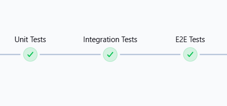

---

## ✅ Unit Testing 

Unit tests are essential to validate the logic within individual services. Below are some key test cases covered across services:

> 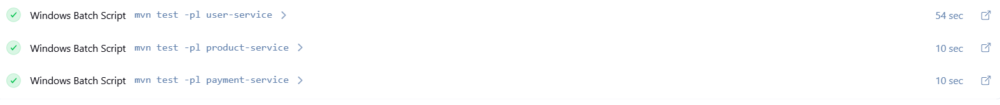

---

## 📦 `user-service`

The unit tests in `user-service` cover essential scenarios such as:

* Retrieving users by ID or username
* Handling non-existent users with proper exception throwing
* Ensuring correct mapping of user entities to DTOs

These are implemented using **JUnit 5** and **Mockito** to mock dependencies and isolate logic effectively.

*Example:*

```java
@Test
void findById_WithInvalidId_ShouldThrowException() {
    when(userRepository.findById(999)).thenReturn(Optional.empty());
    assertThrows(UserObjectNotFoundException.class, () -> userService.findById(999));
}
```

---

### 💳 `payment-service`

Tests in `payment-service` validate core functionality like saving, updating, deleting, and retrieving payments. Integration with external services (via `RestTemplate`) is also mocked.

*Highlights include:*

* Verifying persistence logic with mocked repositories
* Simulating various payment states (e.g., `COMPLETED`, `NOT_STARTED`)
* Handling invalid IDs gracefully

---

#### 🛒 `product-service`

Here, we test key service methods such as:

* Fetching a product category by ID
* Ensuring the correct mapping from domain models to DTOs
* Throwing appropriate exceptions when data isn’t found

*Snippet:*

```java
@Test
void testFindById_ShouldReturnCategoryDto() {
    when(categoryRepository.findById(1)).thenReturn(Optional.of(CategoryUtil.getSampleCategory()));
    CategoryDto result = categoryService.findById(category.getCategoryId());
    assertNotNull(result);
}
```
---

## ✅ Expected Unit Test Results

### `user-service`


All unit tests for the `user-service` were executed successfully, confirming that the core functionalities are working as intended.

---

### `product-service`

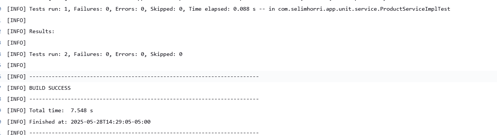

The unit tests in the `product-service` also completed without errors, demonstrating the reliability of the service's internal logic.

---

### `payment-service`

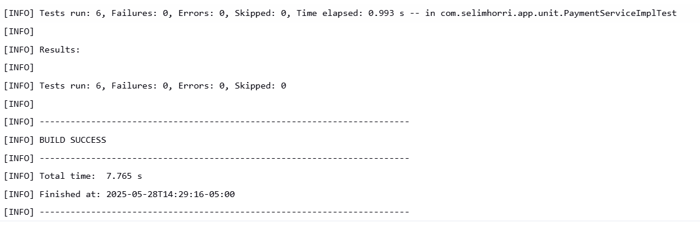

All tests in the `payment-service` passed successfully, ensuring that critical payment operations are functioning correctly.

---

## Integration Tests

During the CI/CD process, integration tests were executed as part of the `integration test` stage in Jenkins:


These tests were designed to validate the interaction between different services in our system — specifically, the `user-service` and `product-service`. Ensuring these services work cohesively is essential for verifying the proper behavior and data flow across the application.

---

### User-Service Integration Tests

The `UserControllerTest` class includes several key scenarios:

* **Creating a user**
* **Retrieving a user by ID**
* **Fetching all users**

Each test leverages Spring Boot’s `TestRestTemplate` to simulate HTTP requests in a realistic environment with an in-memory H2 database. For example, the test to create a user looks like this:

```java
@Test
public void testCreateUser() {
    String url = "http://localhost:" + port + "/user-service/api/users";
    UserDto userDto = UserUtil.getSampleUserDto();
    
    HttpHeaders headers = new HttpHeaders();
    headers.setContentType(MediaType.APPLICATION_JSON);
    
    HttpEntity<UserDto> entity = new HttpEntity<>(userDto, headers);
    
    ResponseEntity<UserDto> response = restTemplate.exchange(
        url,
        HttpMethod.POST,
        entity,
        UserDto.class
    );

    assertEquals(HttpStatus.OK, response.getStatusCode());
    assertEquals(userDto.getEmail(), response.getBody().getEmail());
}
```

This test confirms that the user creation endpoint correctly persists and returns the expected data.

---

### Product-Service Integration Tests

The `ProductControllerIntegrationTest` class covers end-to-end interactions for managing products:

* **Listing all products**
* **Creating a product**
* **Retrieving a product by ID**
* **Deleting a product**

These tests ensure the integrity of core product functionalities. For example, creating a product involves sending a `ProductDto` object with category information:

```java
@Test
public void testCreateProduct() {
    ProductDto productDto = createSampleProduct();
    
    HttpHeaders headers = new HttpHeaders();
    headers.setContentType(MediaType.APPLICATION_JSON);
    
    HttpEntity<ProductDto> request = new HttpEntity<>(productDto, headers);
    
    ResponseEntity<ProductDto> response = restTemplate.exchange(
        baseUrl,
        HttpMethod.POST,
        request,
        ProductDto.class
    );

    assertEquals(HttpStatus.OK, response.getStatusCode());
    assertEquals(productDto.getSku(), response.getBody().getSku());
}
```

The `createSampleProduct` method generates a well-structured product DTO, including category data:

```java
private ProductDto createSampleProduct() {
    CategoryDto categoryDto = CategoryDto.builder()
        .categoryId(1)
        .categoryTitle("Electronics")
        .imageUrl("http://example.com/categories/electronics.jpg")
        .build();

    return ProductDto.builder()
        .productTitle("Test Product")
        .sku("PRD-TEST-001")
        .priceUnit(299.99)
        .quantity(10)
        .categoryDto(categoryDto)
        .build();
}
```

These tests not only validate expected API behavior but also confirm that product data persists correctly across operations like POST, GET, and DELETE.

Running integration tests for both `user-service` and `product-service` ensures that their APIs function as intended and interact properly with the database and each other. These tests act as a safety net during development and deployment, allowing us to detect issues early in the pipeline without relying solely on manual validation.

---


##  ✅ Expected Results

### User-Service Integration Test

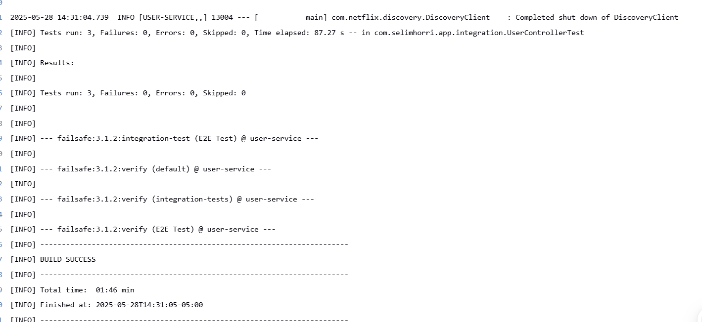

### Product-Service Integration Test

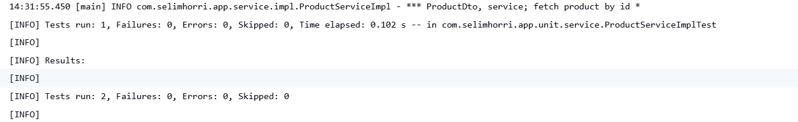

All integration tests for both `user-service` and `product-service` were executed successfully.
This confirms that the core functionalities of each service operate correctly and that the communication and data flow within the system are working as expected.

These results provide confidence that the application behaves reliably under integration scenarios, ensuring consistent behavior across components.

---

## End-to-End (E2E) Testing


The E2E tests are located in the `root/e2e-test` directory and are designed to validate the full user flow across multiple microservices. Each test ensures that the services are not only up and running but also capable of handling real HTTP requests as they would in production.

A basic template was implemented for the `product-service`, where the goal is to verify that the service is active and responsive:

```java
@Test
void shouldGetAllProducts() {
    ResponseEntity<String> response = restFacade.get(productServiceUrl + "/product-service/api/categories", String.class);
    assertTrue(response.getStatusCode().is2xxSuccessful(), "Unexpected status code: " + response.getStatusCode());
}
```

This test confirms that the product service can successfully handle requests to its categories endpoint, indicating it's correctly integrated and operational.

To simulate a realistic end-to-end scenario, the following containers were spun up during the E2E test phase:

* `user-service`
* `product-service`
* `payment-service`
* `order-service`
* `favourite-service`

This setup enables validation of the complete user journey, from browsing products to placing an order and managing favorites.

These E2E tests are expected to run smoothly, as they play a key role in confirming that the entire system works cohesively from the user's perspective.

---

### LOCUST


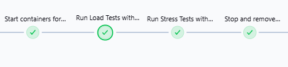

Locust is used to perform performance testing on key microservices such as `order-service`, `payment-service`, and `favourite-service`. Through the CI/CD pipeline, all required services are automatically deployed in Docker containers within an isolated test network (`ecommerce-test`), ensuring each service is healthy before testing begins.

Once the environment is ready, Locust runs load and stress tests from dedicated containers, simulating concurrent users and generating CSV reports. These tests help validate service stability, responsiveness, and scalability before releasing to production.

se realizan pruebas tanto de carga como de estres

---

resultados esperados de una prueba ejecucion de estres para el flujo que tenemos

Cargas


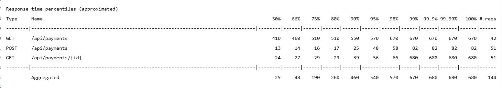
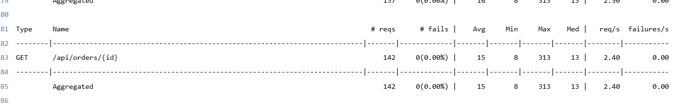
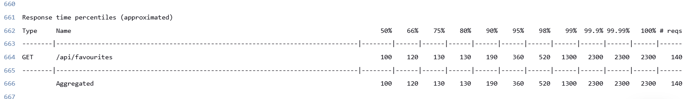


Levantando Locust para prueba de estres.

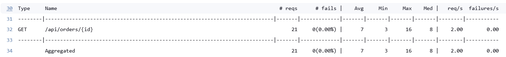
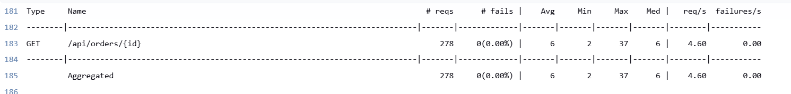


## 8. 📌 Conclusion

> 🛠️ *COMING SOON:* 
